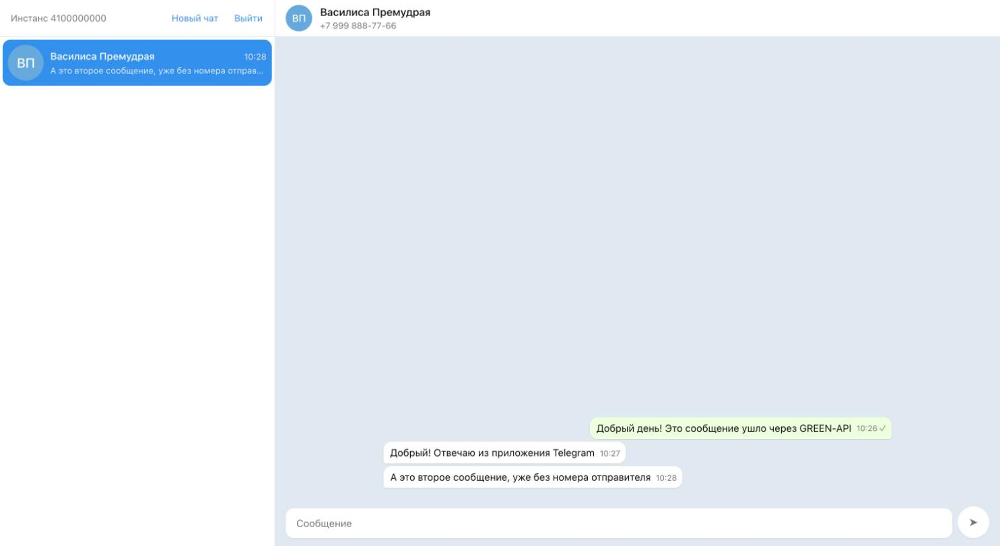
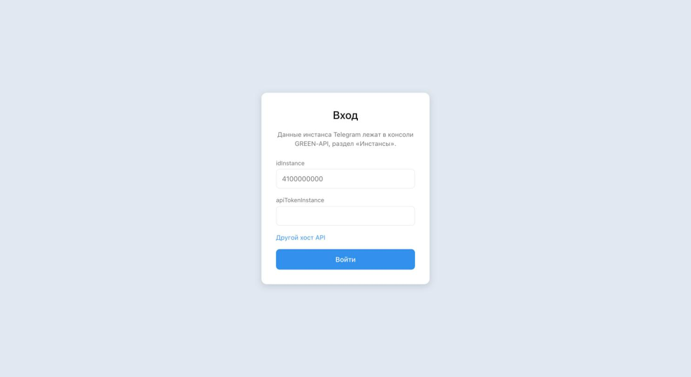
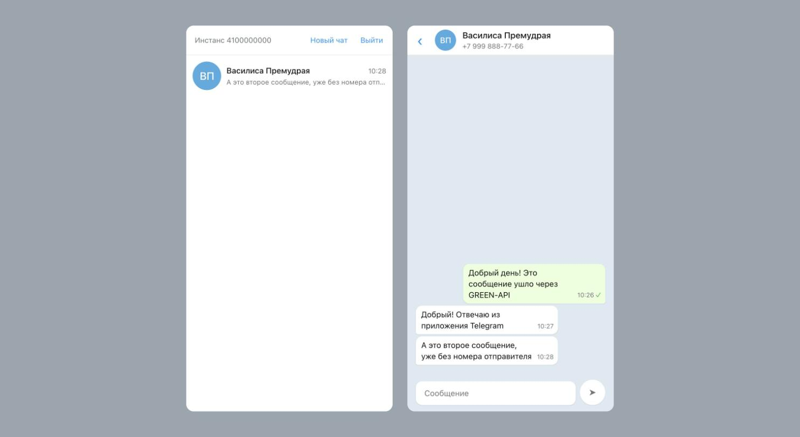

# green-api-telegram-client

Веб-клиент для переписки в Telegram через [GREEN-API](https://green-api.com):
вход по данным инстанса, чат по номеру телефона, отправка текста и приём ответов
через HTTP API. Внешний вид сделан по образцу web.telegram.org.



## Возможности

- вход по `idInstance` и `apiTokenInstance` с проверкой состояния инстанса;
- создание чата по номеру телефона в любом написании (`+7 999 123-45-67`,
  `8 999 123 45 67`, `79991234567`);
- отправка текстовых сообщений со статусами «отправляется», «отправлено»,
  «не отправлено» и причиной неудачи;
- приём входящих длинным опросом очереди уведомлений;
- сообщения, отправленные из приложения Telegram, тоже видны в переписке;
- переписка переживает перезагрузку страницы;
- предупреждение, если настройки инстанса не дают принимать сообщения.

Только текст: файлы, картинки и групповые чаты не поддерживаются.

## Запуск

Нужен Node.js 22 или новее.

```
npm install
npm run dev
```

Приложение откроется на `http://localhost:5173`.

Другие команды:

```
npm run build      сборка в dist/
npm run preview    просмотр собранной версии
npm run lint       oxlint
npm test           vitest
```

## Что нужно от GREEN-API

1. Зарегистрируйтесь на [green-api.com](https://green-api.com) и создайте
   инстанс Telegram.
2. Авторизуйте инстанс в консоли — привяжите аккаунт Telegram.
3. Скопируйте `idInstance` и `apiTokenInstance` из раздела «Инстансы».

Приём сообщений идёт через HTTP API, а не через вебхуки, поэтому в настройках
инстанса должно быть так:

| настройка | значение |
| --- | --- |
| `webhookUrl` | пусто |
| `incomingWebhook` | `yes` |
| `outgoingMessageWebhook` | `yes` |

Если что-то из этого не так, приложение покажет предупреждение над списком чатов.
Поле `apiUrl` по умолчанию `https://api.green-api.com`; если консоль показывает
для инстанса другой хост, его можно задать на экране входа под ссылкой
«Другой хост API».



## Как устроено

```
src/
  api/          fetch-клиент GREEN-API и формы ответов
  lib/          разбор уведомлений, номер телефона, формат времени
  store/        модель чатов, reducer, localStorage
  hooks/        цикл получения уведомлений
  components/   экраны и элементы интерфейса
  styles/       палитра и сброс
```

Стек: Vite, React 19, TypeScript, CSS Modules, Vitest, oxlint. Состояние —
`useReducer`, без внешних стейт-менеджеров.

Три вещи в GREEN-API, из-за которых разбор уведомлений вынесен в отдельный слой:

1. **Чат и его идентификаторы.** Первое сообщение уходит по номеру
   (`79991234567@c.us`), а ответ приходит с числовым `chatId` Telegram. Чат
   находится по номеру отправителя, после чего его `chatId` запоминается —
   по нему узнаются следующие сообщения, даже если собеседник скрыл номер.
2. **Эхо своей отправки.** На каждое отправленное сообщение приходит
   уведомление с тем же `idMessage`, что вернул `sendMessage`. Без сверки по
   `idMessage` сообщение задвоилось бы.
3. **Чужой номер в исходящих уведомлениях.** В `outgoingMessageReceived` поле
   `senderPhoneNumber` — номер самого инстанса, а не собеседника. Собеседник
   только в `chatId`.

Плюс: подтверждать через `deleteNotification` нужно каждое полученное
уведомление, включая те типы, которые приложению не нужны, — иначе очередь
встанет на первом неподтверждённом.

## На узком экране

Список чатов и переписка занимают всю ширину по очереди, возврат к списку —
стрелкой в шапке чата.



## Ограничения

- Токен инстанса хранится в `localStorage` в открытом виде. Для тестового
  задания это сознательный компромисс: иначе учётные данные пришлось бы вводить
  после каждой перезагрузки. В рабочем сервисе запросы к GREEN-API шли бы через
  собственный бэкенд, а токен не попадал бы в браузер.
- Очередь уведомлений у инстанса одна. Если открыть приложение в двух вкладках,
  они разберут входящие между собой, и часть сообщений окажется только в одной.
- История сообщений не загружается с сервера: в переписке видно только то, что
  пришло и ушло при работающем приложении.

## Лицензия

MIT, см. [LICENSE](LICENSE).
